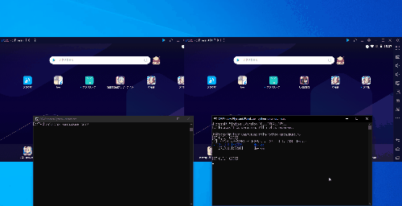

# python-umamusume
ウマ娘自動リセマラ周回を Python の [android-auto-play-opencv](https://github.com/noitaro/android-auto-play-opencv "android-auto-play-opencv") を使って実現させました。

## Readme
https://noitalog.tokyo/python-umamusume/

## How to use
[NoxPlayer](https://jp.bignox.com/ "NoxPlayer") が必要です。

このリポジトリをダウンロードして、ライブラリをインストールして下さい。
```
pip install android-auto-play-opencv
```

### 実行
NoxPlayer の画面解像度を 960×540 に設定する。

事前にチュートリアルを1回終わらせて、スキップ出来る状態にする。
```
Python umamusume.py
```

### ハーフアニバーサリーに対応 2021/08/29：[@DenimPauel氏](https://github.com/DenimPauel)追記
ハーフアニバーサリープレゼント服に対応。

### ハーフアニバーサリーに対応 2021/08/28：[@DenimPauel氏](https://github.com/DenimPauel)追記
対象ガチャを変更する場合、GET_PRETTY_DARBY_GATYA で切り替える。
```Python
# ターゲットガチャの選択
GET_PRETTY_DARBY_GATYA = True  # サポートガチャをターゲットにする場合は、Falseにする。
```
リスタート時、キャッシュをクリアする。

### 複数端末に対応 2021/06/20：追記
https://noitalog.tokyo/multi-startup/


```Python
# ↓複数デバイスを同時に操作したい場合、コメントを外す。
import inquirer  # pip install inquirer

# ↓複数デバイスを同時に操作したい場合、コメントを外す。
devicesselect = [
    inquirer.List(
        "device",
        message="デバイスを選択して下さい。",
        choices=aapo.adbl.devices
    )
]
selected = inquirer.prompt(devicesselect)
aapo.adbl.setdevice(selected['device'])
```
